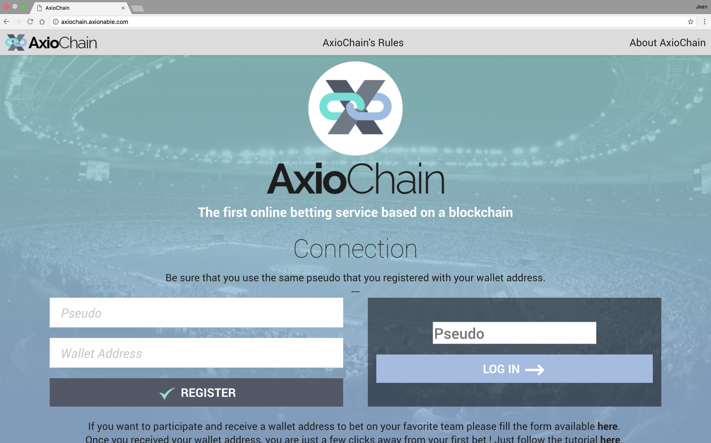
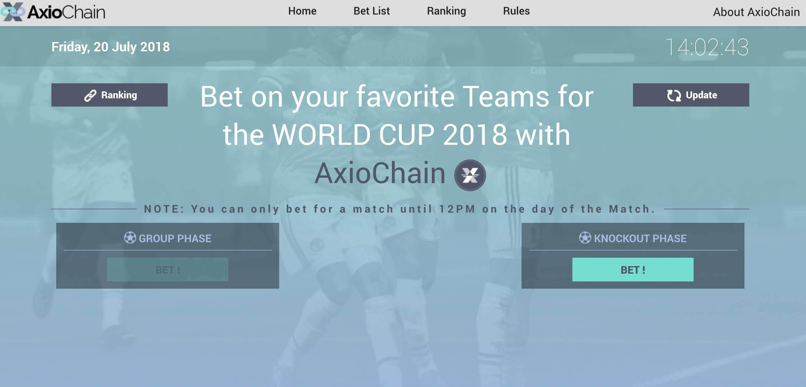
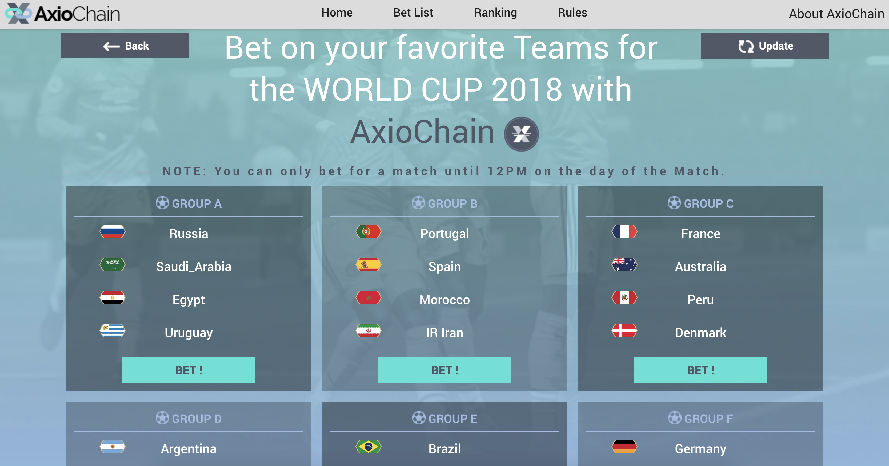
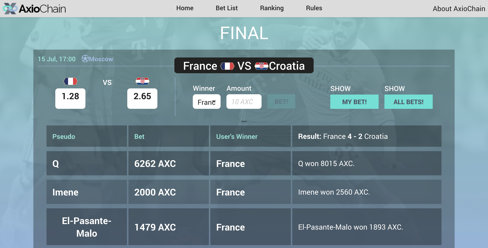

# AxioChain

AxioChain is a Descentralized Application which uses the Ethereum technology.

## Introduction

The AxioChain provides a first approach to a Dapp implementation on Ethereum. It provides the Smart Contracts' code as well as the web implementation using Solidity, javascript and web3js.

It was developped for the World Cup to build a Dapp where we can track users' bets on their favorite team.

## Repository Structure

- The directory <b>Dapp_AxioChain</b> contains all the code of the web application.
- The directory <b>Solidity_Contracts</b> contains all the code of the smart contracts.

## Screenshot

Home page of the Dapp:

Other screenshots of the Dapp:

## Tech/framework used

<b>Smart contract implementation:</b>
- [Solidity](https://solidity.readthedocs.io/en/v0.4.24/#)
- [Remix](https://remix.ethereum.org)

<b>Web Application:</b>
- Javascript and php
- [web3js](https://github.com/ethereum/wiki/wiki/JavaScript-API)

<b>Note:</b> The code to manage the events and interactions with the web application does not use the last vesion of web3js.

To interact with the application, you should install a plugin in your browser: [Metamask](https://metamask.io)

To run the Dapp locally, you can use a local server environment such as MAMP, XAMMP, LocalServer, etc.

## Contribute

AxioChain is totally free and open for everyone to use, please feel free to contribute!
If this repository help you to develop a new Dapp, please make a reference to this project.

## Other Sources

AxioChain was inspired in codes examples from:

- [Web3js tutorial](https://coursetro.com/posts/code/99/Interacting-with-a-Smart-Contract-through-Web3.js-(Tutorial))
- [Cryptozombies Tutorial](https://cryptozombies.io)

## Next steps

Here is a list of some improvements that you could do to build a better Dapp:

- Add an oracle.
- Add an admin web page to interact with the smart contract (The interaction with the smart contract was done using Remix).
- Split the smart contract for the token and the Dapp.
- Add a dynamic update of odds according the number of bets.
- Add the score of the match per bet.
- ...

## About Axionable

Axionable is a leading Data Science and Data Consulting firm based on Paris, France. For knowing more about our projects and careers please visit our [website](https://www.axionable.com). Follow us on [Twitter](https://twitter.com/AxionableData).

Develop by [JC](https://twitter.com/jcupe17)
